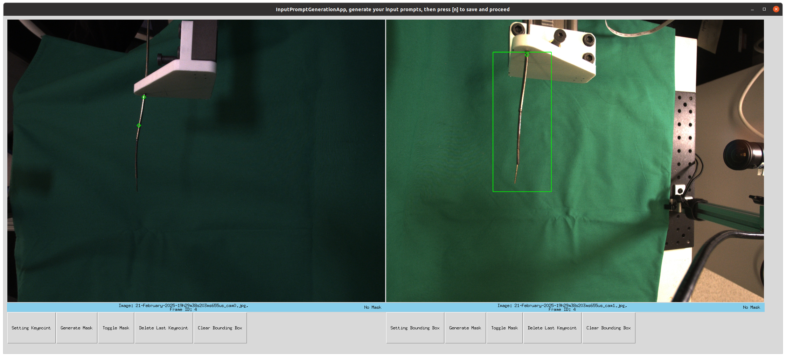
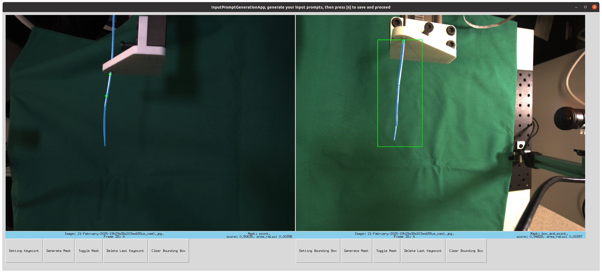
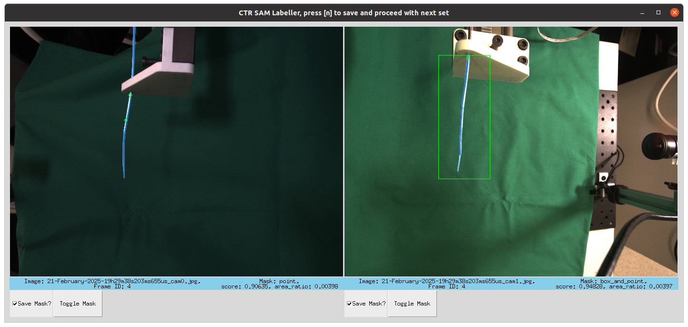

# Install
Install SAM2,
https://github.com/facebookresearch/sam2
using their installation instructions with CONDA, and CUDA. Make sure to have a GPU with sufficient memory.

Download the "sam2.1_hiera_large.pt" checkpoint, then copy and paste the model in the same folder as main.py. 

Install dependencies:
```bash
pip install opencv-python matplotlib pandas
```
# Usage
To run program, with an input prompt generation app:
```bash
cd ctr_labeller
python main.py --data-path /path/to/reference/file/folder --use-gui True
```
or if you have an input prompt json in the data folder, to load:
```bash 
cd ctr_labeller
python main.py --data-path /path/to/reference/file/folder --use-gui True --input-prompt-json-name input_prompts.json
```
## Command Line Flags
```
usage: main.py [options]

options:
  -h, --help
        show this help message and exit
  --data-path ARG
        Directory containing reference file
  --use-gui ARG
        User actively specifies which masks to save with the GUI
  --use-video ARG
        Use SAM2 video predictor (temporal tracking) instead of per-frame prediction
  --input-prompt-json-name ARG
        Name of input prompt file
  --input-prompt-app-image-height ARG
        Input prompt app image height
  --batch-num ARG
        Process this batch number only
  --save-image-appended-with-masks ARG
        Save images with mask overlays
  --sort-based-on ARG
        Criteria on how masks are selected
  --max-size-to-add ARG
        Number of images to load at one time for processing
```
# GUI Program
## Input Prompt Generation


If there is no input prompt json file or if the file path is invalid, the app will require input prompts to be created. The first of the remaining stereoimages in the reference.csv file will be shown as an aid to generate prompts, and these input prompts will then be used to generate masks for all remaining stereoimages. The five buttons under each image and their uses are as follows:
- **Setting Keypoint/Bounding Box**: There are two types of input prompts: keypoints and bounding boxes. Toggling this button will trigger the different modes. Keypoints are specified by left-clicking on the image. A bounding box is specified by left-clicking for the top-right corner and right-clicking for the bottom-right corner.
- **Generate Mask**: Generates a mask based on the input prompts specified. Note this mask is not saved, but for verifying the input prompts.
- **Toggle Mask**: Toggles the generated mask on and off.
- **Delete Last Keypoint**: Deletes the last keypoint. 
- **Clear Bounding Box**: Clears the bounding box.

Specifying or deleting a keypoint or bounding box resets the generated mask. Press 'n' to save the input prompts.
## Mask Generation

The mask generation screen is shown if the use-gui flag is enabled. If enabled, user actively specifies which masks to save based on the GUI. Press 'n' to move to the next set of processed stereo masks (overlaid in blue). If 'Save Mask?' is checked, the mask will be saved. If flag not enabled, all masks will be processed and saved automatically.

# Dataset and Reference csv file
This program requires you to give the path to the folder with a reference.csv. Your reference csv can allow different image saving folder structures
but requires that the images are saved under an "imgs" folder because the program will use the specific string to create a "masks" folder beside it. 
It will then save masks with the same subfolder structure as the images.
We suggest the following structure for the reference file and saving of images and masks:
```
├── some_folder_on_computer
|   |── some_robot_configuration    # data for a set of tubes
|       |- reference.csv            # reference file
|       |- input_prompts.json       # created by this program
|       |- run1                     # different folders per run as data collection could be done over several days
|           |── imgs                # images
|               |-0 
|                    |- filename1_cam0.jpg
|                    |- filename1_cam1.jpg
|                    |- ...
|               |-1
|                    |- ...
|           |- masks                    # created by this program
|               |-0
|                    |- mask_filename1_cam0.jpg
|                    |- mask_filename1_cam1.jpg
|                    |- ...
|               |-1
|                    |- ...
|           |- image_and_masks          # created by this program (not default)
|               |- ...
|       |── run2
|           |── imgs                # images
|               |-0 
|                    |- filename10001_cam0.jpg
|                    |- filename10001_cam1.jpg
|                    |- ...
|               |-1
|                    |- ...
|           |- masks                    # created by this program
|               |-0
|                    |- mask_filename10001_cam0.jpg
|                    |- mask_filename10001_cam1.jpg
|                    |- ...
|               |-1
|                    |- ...
|           |- image_and_masks          # created by this program (not default)
|               |- ...
|       |── run3 ...
```

One single reference csv file should hold all the relative paths to each stereoimage pair with at least the following columns:

| frame_id | left_image_path | right_image_path |
| ----------- | ----------- | ----------- |
| 1 | run1/imgs/0/filename1_cam0.jpg | run1/imgs/0/filename1_cam1.jpg |
| 2 | run1/imgs/0/filename2_cam0.jpg | run1/imgs/0/filename2_cam1.jpg |
| ... | ... | ... |

# License
The model is licensed under the [Apache 2.0 license](https://github.com/paulhskang/ctr_data_pipeline/blob/main/LICENSE.txt).

# BibTeX
If you want to reference this project, you can use the following citation:
```bibtex
    @INPROCEEDINGS{kang_ismr_2025,
      author={Kang, Paul H. and Gondokaryono, Radian and Roshanfar, Majid and Nguyen, Robert H. and Looi, Thomas and Drake, James M. and Podolsky, Dale},
      booktitle={2025 International Symposium on Medical Robotics (ISMR)}, 
      title={Learning Inverse Kinematics Multiplicity of Concentric Tube Robots Using Invertible Neural Networks}, 
      year={2025},
      volume={},
      number={},
      pages={157-163},
      keywords={},
      doi={10.1109/ISMR67322.2025.11025969}
    }
```
